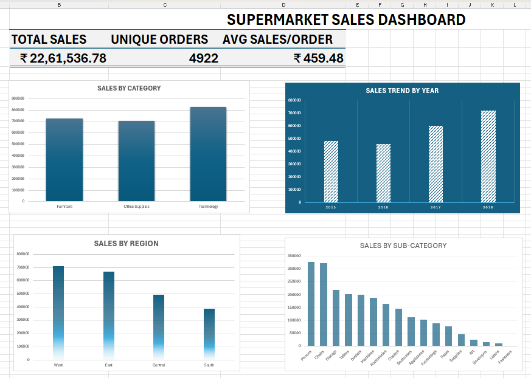

# Supermarket Sales Dashboard

## Project Overview

This project is an Excel-based Sales Dashboard created using Superstore Sales Data.

The objective of this project is to clean, analyze, and visualize sales data using Excel Pivot Tables, Pivot Charts, KPIs, and Conditional Formatting.

## 🎯 Objectives

- Analyze total sales
- Analyze sales by category
- Analyze sales trends over time
- Analyze sales by region
- Analyze sales by sub-category
- Identify high and low performing sub-categories
- Create an interactive and easy-to-understand dashboard

## 🛠️ Tools Used

- Microsoft Excel
- Pivot Tables
- Pivot Charts
- Conditional Formatting
- Excel Formulas

## Data Cleaning

The dataset was checked and cleaned for:

- Duplicate records
- Missing values in important fields
- Data type consistency
- Date formatting
- Category and sub-category consistency
- Invalid sales values
- Order Date and Ship Date consistency

## 📈 Key Performance Indicators

KPI : Value 
Total Sales : ₹22,61,536.78 
Unique Orders : 4,922 
Average Sales per Order : ₹459.48 

##  Key Findings

### Sales by Category

- Technology generated the highest sales.
- Furniture and Office Supplies followed.

### Sales Trend

- Sales were ₹479,856.21 in 2015.
- Sales decreased slightly to ₹459,436.01 in 2016.
- Sales increased to ₹600,192.55 in 2017.
- 2018 recorded the highest sales at ₹722,052.02.

### Sales by Region

- West had the highest sales.
- South had the lowest sales among the four regions.

### Sales by Sub-Category

- Phones had the highest sales among sub-categories.
- Fasteners had the lowest sales.
- Conditional Formatting was used to highlight high and low performing sub-categories.

## 📊 Dashboard

The Excel workbook contains:

- Cleaned dataset
- Sales by Category Pivot Table
- Sales by Year Pivot Table
- Sales by Sub-Category Pivot Table
- Sales by Region Pivot Table
- Top Customers analysis
- Final Sales Dashboard

## Data Limitation

The provided dataset does not contain a `Profit` column. Therefore, Profit by Category could not be calculated from the supplied dataset without introducing unsupported or fabricated values.

The analysis and dashboard therefore focus on the available sales data.

## Project File

The complete Excel workbook containing the dataset, Pivot Tables, analysis, and dashboard is included in this repository.

**File:** `Superstore_Sales_Cleaned.xlsx`
